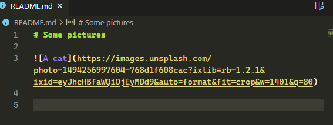

# Shorten URL

Adds an option to the context menu to shorten the selected URL to a TinyURL

## Features

If the selection is a valid URL, it is replaced with a TinyURL redirect

### Example

>`https://www.website.com/longlonglonglonglonglonglonglonglong.html`
>
>**Right Click** -> *Covert to TinyURL*
>
>`http://tinyurl.com/abcdef`

You can also press `ctrl`-`shift`-`p` to open the Command Palette, and type **Convert to TinyURL**

## Releases

1.0.0
- Initial release

